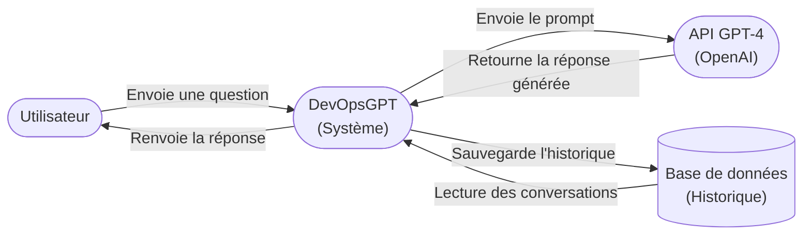
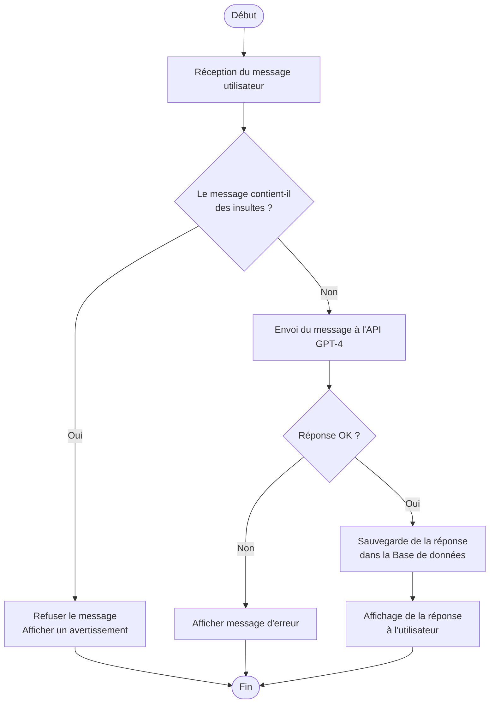

# Réponses - Évaluation Finale DevOpsGPT

**Étudiant :** Chems MITTA
**Date :** 21/05/2026

---

## Exercice 1 : Conception Logicielle

### 1. Diagramme de Contexte

Le système **DevOpsGPT** interagit avec un acteur (l'Utilisateur) et deux systèmes externes (l'API GPT-4 et la Base de données).



---

### 2. Organigramme / Flowchart

Étapes de fonctionnement lors de l'envoi d'un message par l'utilisateur :



---

### 3. Dictionnaire de données

Attributs à stocker pour un `Message` :

| Nom de la donnée | Type           | Description                                                                 |
| ---------------- | -------------- | --------------------------------------------------------------------------- |
| `id`             | UUID / Integer | Identifiant unique du message (clé primaire).                               |
| `contenu`        | String (Text)  | Texte saisi par l'utilisateur ou réponse générée par l'IA.                  |
| `auteur`         | String (Enum)  | Origine du message : `user` ou `assistant`.                                 |
| `date_creation`  | DateTime       | Date et heure d'envoi du message (horodatage ISO 8601).                     |
| `user_id`        | UUID / Integer | Identifiant de l'utilisateur ayant initié la conversation (clé étrangère). |
| `conversation_id`| UUID           | Identifiant de la conversation à laquelle le message appartient.            |
| `modele_ia`      | String         | Nom du modèle utilisé pour générer la réponse.          |

---

## Exercice 2 : Git et Docker

### 1. Méthodologie et Git

#### Question A — User Story

**En tant qu'** utilisateur de DevOpsGPT, **je veux** pouvoir souscrire à un abonnement Premium mensuel par paiement en ligne, **afin de** bénéficier d'un accès illimité aux modèles avancés, d'une priorité de traitement et d'un historique de conversations étendu.

**Critères d'acceptation :**
- L'utilisateur peut choisir une formule (mensuelle / annuelle).
- Le paiement est sécurisé (Stripe ou équivalent).
- Le statut « Premium » est activé immédiatement après paiement.
- L'utilisateur reçoit un e-mail de confirmation.

#### Question B — Commandes Git

**1. Créer la branche feature et faire un commit :**

```bash
git checkout -b feature-premium-subscription

git add .
git commit -m "feat: implémentation de l'abonnement Premium"
git push -u origin feature-premium-subscription
```

**2. Une fois la PR fusionnée sur `main`, créer un tag de version :**

```bash
git checkout main
git pull origin main
git tag -a v1.0.0 -m "Release v1.0.0 - Abonnement Premium"
```

**3. Pousser le tag sur GitHub :**

```bash
git push origin v1.0.0
```

---

### 2. Dockerisation

Voir les fichiers :
- [backend/Dockerfile](backend/Dockerfile)
- [frontend/Dockerfile](frontend/Dockerfile)

---

### 3. Orchestration avec Docker Compose

Voir le fichier [docker-compose.yml](docker-compose.yml) à la racine du projet.

**Pour lancer la stack complète :**

```bash
docker compose up --build
```

---

## Exercice 3 : CI/CD avec GitHub Actions

### 1. Le Workflow CI/CD

Voir le fichier [.github/workflows/main.yml](.github/workflows/main.yml).

---

### 2. Sécurité et Secrets

#### Question A — Où enregistrer le secret `OPENAI_API_KEY` sur GitHub ?

Sur l'interface web de GitHub :

1. Aller dans le dépôt GitHub du projet.
2. Cliquer sur l'onglet **`Settings`** (en haut à droite du dépôt).
3. Dans le menu de gauche, dérouler la section **`Secrets and variables`**.
4. Cliquer sur **`Actions`**.
5. Cliquer sur le bouton vert **`New repository secret`**.
6. Renseigner :
   - **Name** : `OPENAI_API_KEY`
   - **Secret** : la valeur de la clé
7. Cliquer sur **`Add secret`**.

Le secret est désormais chiffré et accessible uniquement par les workflows GitHub Actions du dépôt — il n'est jamais affiché en clair, même aux administrateurs.

**Chemin complet :** `Repository > Settings > Secrets and variables > Actions > New repository secret`

#### Question B — Syntaxe d'injection dans le workflow YAML

Dans `.github/workflows/main.yml`, on injecte le secret comme variable d'environnement avec la syntaxe `${{ secrets.NOM_DU_SECRET }}` :

```yaml
- name: Déploiement
  if: startsWith(github.ref, 'refs/tags/v')
  env:
    OPENAI_API_KEY: ${{ secrets.OPENAI_API_KEY }}
  run: echo "Déploiement en cours..."
```
